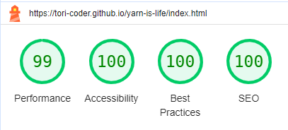

# YARN IS LIFE
Code Institude First Portfolio Project HTML and CSS only

Yarn Is Life is a static website designed to introduce people to the art of crochet and invite them to join a crochet club. It was inspired by my daughter who loves to crochet.

Visit the live site [here](https://tori-coder.github.io/yarn-is-life/)

## CONTENTS
1. [Design](#design)
2. [Features](#features)
3. [UX](#ux)
4. [Testing](#testing)
5. [Credits](#credits) 

## DESIGN

### Colour Choices
The colours were based on the colour palette of the hero image, which was sourced from istock [here](https://www.istockphoto.com/es/foto/fondo-de-pasatiempo-artesanal-con-hilo-en-colores-naturales-gm1349994486-426293103)
The remaining colours were picked from the hero image using the chrome extension [colorzilla](https://chromewebstore.google.com/detail/colorzilla/bhlhnicpbhignbdhedgjhgdocnmhomnp) and by reference to [coolors.co](https://coolors.co/)

### Fonts
The main font of the site is Segoe UI for accessibility.
The Yarn Is Life logo has been styled using BrittanySignature, from [befonts.com](https://befonts.com/brittany-signature-font.html)

### Images
Images are sourced from [istock](https://www.istockphoto.com/) with the exception of the About Me picture and the Latest Projects images, which were taken by and are property of my daughter, Georgina Carey.

## FEATURES

### Navigation Bar
The navigation bar is at the top of all pages. It consists of the Yarn Is Life logo and links to the Home, Club and Patterns pages.
The bar is designed to be one line, no collapse (no hamburger menu) regardless of screen size.

### Hero Image
The [hero image](assets/images/readme-imgs/hero-image-min.jpg) was chosen for its natural colours and inviting depiction of yarn for crochet. The blank space near the centre of the image was used as a canvas for the hero text.

### Contents

**Home page**

The user is greeted with the hero image and hero text saying welcome to the site. On smaller screens the About Me section is also visible. The home page also contains a Learn to Crochet section and a Latest Projects section.

**Club Page**

The club page includes locations and times of the crochet club meetups.
There is also a form to join the mailing list to be informed of future club events. (The form is a dummy one - at present it links merely to the Code Institute formdump page, but in future I hope to link it to a real database)

**Patterns Page**

This page includes live links to patterns available on other crochet pages. Links open in a new tab.
Patterns are divided into Beginner, Intermediate and Advanced sections for easy navigation.

### Footer

The footer contains icons for facebook, twitter xxx, youtube and instagram. The links open in a new tab.

### Potential Future Features

It would be nice to add a third UX feature: Frequent Visitor Objectives - be able to submit own projects to be featured on the site.

Work has begun on a "learn to crochet" page featuring original learn-to-crochet instructions and images, not linking to any external sites. It will need to be styled and a link to it added in the header.

There was originally a youtube video embedded using an iframe in index.html, which was later removed (see ["unfixed bugs"](#unfixed-bugs)). I will reintroduce the video after submission and am researching how to resolve the errors thrown up by the iframe. 

In future, the mailing list form will link to a database.

## UX

### First Time Visitor Objectives

* Instantly understand who and what the site is for
* Be able to navigate the site easily
* Be able to find information related to crochet

## Returning Visitor Objectives

* As first visitor objectives
* See new information (latest projects) immediately on visiting the site
* Be able to find up to date information about club meetings

## TESTING

### Fixed Bugs
Hero image failed to load on first try. Html  element had href attribute instead of src attribute - amended.

Latest projects section was unresponsive to screen size. Flexbox properties had been added to the wrong container div in html - fixed.
 
### Unfixed Bugs
There was originally a youtube video embedded using an iframe in index.html. There were several issues with sizing the iframe to fit its container, which were solved, and the video was correctly sized for all screen sizes and played correctly. However, on testing the iframe threw up multiple errors. It wasn't feasible to learn enough about all of these errors to overcome this in time for submission, so regretfully the video was removed and replaced with an image.

### Validation Testing

#### HTML and CSS

[W3C](https://validator.w3.org/) was used to validate the HTML on all pages of the website.

[W3C jigsaw](https://jigsaw.w3.org/css-validator/) was used to validate the css.

index.html - Passed.

patterns.html - Passed.

club.html - 0 errors, 1 warning: "The inputmode attribute is not supported in all browsers."

The "inputmode=numeric" attribute was chosen to avoid using the "type=number" attribute (and thus avoid the increase/decrease arrows for the input box). Since the phone number is optional and even if entered as text would lead to no errors, this was considered acceptable.

style.css - Passed, no errors found.

#### Chrome Developer Tools Lighthouse rating

      
### Browser Testing

| Browser   | Layout    | Functionality | 
| :--- | :---: | :---: |
| Chrome | ✔ | ✔ |
| Edge | ✔ | ✔ |
| Firefox | ✔ | ✔ |
| Safari | ✔ | ✔ |

### Manual Testing

All links were clicked through and found to be correct.
When information in the mailing list form is submitted via the submit button, it correctly shows as entered into the Code Institute formdump. The form cannot be submitted without completing the required fields.

## Deployment

The site was deployed on [github pages](https://tori-coder.github.io/yarn-is-life/) and on [netlify](https://yarnislife.netlify.app/) from the main branch. 

## CREDITS

- Header and footer styled with reference to the Love Running walkthrough project by Code Institute
- Social media icons from [fontawesome.com](https://fontawesome.com/)
- BrittanySignature font from [befonts.com](https://befonts.com/brittany-signature-font.html)
- Favicon generated using [favicon.io](https://favicon.io/) using an image cropped from the hero image
- Model image of live website on different devices generated at [techsini.com](https://techsini.com/multi-mockup/index.php)
- Images from [istock](https://www.istockphoto.com/)
- Images converted using [cloudconvert.com](https://cloudconvert.com/webp-converter)
- Images compressed using [imagecompressor.com](https://imagecompressor.com/)
- Crochet tutorials and patterns (and their accompanying images) from: 
[Handmade by Ani](https://handmadebyani.blogspot.com/),
[The Woobles](https://thewoobles.com/),
[Jewels and Jones](https://jewelsandjones.com/),
[easycrochet.com](https://easycrochet.com/),
[gatheringbeauty.com](https://www.gatheringbeauty.com/),
[hanjancrochet.com](https://www.hanjancrochet.com/),
[lovecrafts.com](https://www.lovecrafts.com/),
[yarnspirations.com](https://www.yarnspirations.com/),
[mycrochetpattern.com](https://mycrochetpattern.com/),
[mijocrochet.se](https://mijocrochet.se/)
- This README file was constructed using [advice](https://github.com/kera-cudmore/readme-examples) from Kera Cudmore 